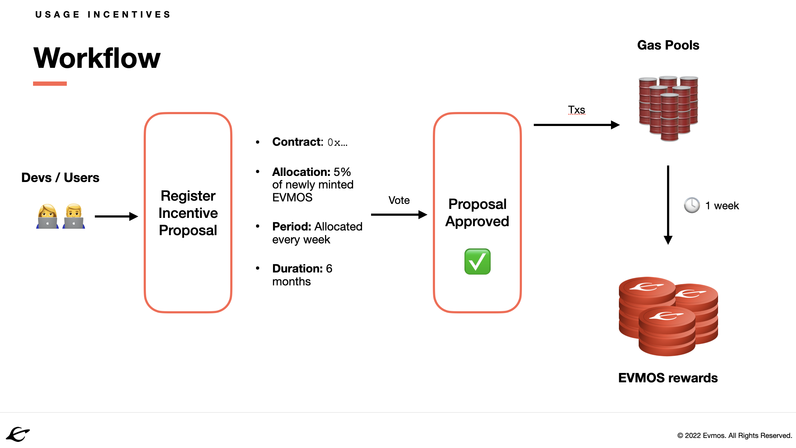

<!--
order: 5
-->

# Smart Contract Incentive Registration

Learn how to register smart contract incentives through [Evmos Governance](../../users/governance/overview.md). {synopsis}

An incentive for a smart contract can be registered through governance to encourage more interaction with that contract. Users who interact with a registered contract (eg. through submission of transactions) will have rewards distributed to them. These rewards are essentially cash-back for the gas spent on the initial transactions.

The incentives workflow is summarized in the following image:



To register smart contract incentives, consider the following stages:

1. [Drafting the Contract Incentives Proposal](#drafting-the-contract-incentives-proposal)
2. [Submitting the Contract Incentives Proposal](#submitting-the-contract-incentives-proposal)
3. [The On-Chain Contract Incentives Proposal](#the-on-chain-contract-incentives-proposal)

This document also discusses [incentives analysis through telemetry](#incentives-analysis-through-telemetry).

Check out the [incentives module specification](../../../x/incentives/spec/README.md) for more information on incentives.

## Drafting the Contract Incentives Proposal

The following topics must be addressed when drafting a Contract Incentives Proposal:

1. Provide the profile of the person(s)/entity making the proposal.

    Who are you? What is your involvement in Cosmos and/or other blockchain networks? If you are working with a team, who are the team members involved and what is their relevant experience? What is the mission statement of your organization or business? Do you have a website? Showcase some work you've done, and some proof of who you are.

2. Promote understanding of the `x/incentives` Module.

    Make sure to mention the [`x/incentives` Module Documentation](../../../x/incentives/spec/README.md) along with a brief explanation of what the `x/incentives` Module does. It's also a good idea to link the [Evmos Token Model](https://medium.com/evmos/the-evmos-token-model-edc07014978b), since incentives are directly intertwined with Evmos tokenomics!

3. Describe what changes are being made, and why they are required.

    Give a breakdown of the proposal's payload, and explain in layman's terms what the proposal will do if it passes. For the smart contract in question, provide general information on its purpose, along with an argument for why it requires incentives. Mention risks involved in the proposal, depending on the traction of the smart contract involved and the timetable for the proposed incentives. Finally, detail precautions taken during proposal formulation, if applicable (including consultations made prior to proposal creation, and any third-party reviews).

Remember to provide links to the relevant [Commonwealth Evmos community](https://commonwealth.im/evmos) discussions concerning your proposal, as well as the [proposal on testnet](#submit-the-proposal-to-the-testnet).

## Submitting the Contract Incentives Proposal

After the drafting process, the Contract Incentives Proposal can be submitted.

### Formatting the Proposal's Text

The ideal format for a proposal is as a Markdown file (ie. `.md`) in a Github repo or [HackMd](https://hackmd.io/). Markdown
is a simple and accessible format for writing plain text files that is easy to
<!-- markdown-link-check-disable-next-line -->
learn. See the [Github Markdown Guide](https://docs.github.com/en/get-started/writing-on-github/getting-started-with-writing-and-formatting-on-github/basic-writing-and-formatting-syntax) for details on
writing markdown files.

### Submit the Proposal to Testnet

To [submit the proposal](../../users/governance/submitting.md) to testnet through the command line with [`evmosd`](../../validators/quickstart/binary.md), use the following command with `register-incentive`:

```bash
evmosd tx gov submit-proposal \
  register-incentive \
  $CONTRACTADDRESS \
  $ALLOCATION \
  $NUMWEEKS \
  --title=<title> \
  --description=<description> \
  --deposit="1000000aevmos" \
  --from=<mykey> \
  --chain-id=<testnet_chain_id> \
  --node <address>
```

with the following arguments:

- `$CONTRACTADDRESS`: Ethereum hex-formatted (`0x...`) address of the contract that users will interact with in your dApp. If you are using several external/internal contracts, **make sure the contract is the correct one**.
- `$ALLOCATION`: Denominations and percentage of the total rewards (25% of block distribution) to be allocated to users that interact and spend gas using the `$CONTRACTADDRESS` (eg. `"0.005000000000000000aevmos"` will distribute 0.5% of out of the 25% tokens minted on each daily epoch rewards).
- `$NUMWEEKS`: Number of weeks (counted by epochs) that you want the `$CONTRACTADDRESS` to be incentivized for.

    - 6 months (`26` epochs): recommended for long-term incentives on apps that have a lot of traction
    - 3 months (`13` epochs): recommended for long-term incentives on apps that have some traction
    - 1 months (`4` epochs): recommended for short-term incentives on apps that don't have much traction

See below for an example using [Diffusion Finance's](https://diffusion.fi/) router contract:

```bash
evmosd tx gov submit-proposal register-incentive 0xFCd2Ce20ef8ed3D43Ab4f8C2dA13bbF1C6d9512F 0.050000000000000000aevmos 13 --description=$DESCRIPTION --title=$PROPOSALTITLE
```

However, note that if the CLI is used to create a proposal, and `description` is set using a flag, the text will be [escaped](https://en.wikipedia.org/wiki/Escape_sequences_in_C) which may have undesired effects. If the proposal creator is using markdown or line breaks it's recommended to put the proposal text into a json file and include that file as part of the CLI proposal, as opposed to individual fields in flags. The process of creating a json file containing the proposal can be found [here](../../users/governance/submitting.md#formatting-the-json-file-for-the-governance-proposal), and the CLI command for submitting the file is below:

```bash
evmosd tx gov submit-proposal register-incentive --proposal=<path_to_json>
```

You may want to submit your proposal to the testnet chain before the mainnet for a number of reasons, such as wanting to see what the proposal description will look like, to share what the proposal will look like in advance with stakeholders, and to signal that your proposal is about to go live on the mainnet.

Submitting your proposal to the testnet increases the likelihood of engagement and the possibility that you will be alerted to a flaw before deploying your proposal to mainnet.

## The On-Chain Contract Incentives Proposal

A majority of the voting community should probably be aware of the proposal and have considered it before the proposal goes live on-chain. If you're taking a conservative approach, you should have reasonable confidence that your proposal will pass before risking deposit contributions by [submitting the proposal](../../users/governance/submitting.md). Make revisions to your draft proposal after each stage of engagement.

### The Deposit Period

The deposit period currently lasts 14 days. If you submitted your transaction with the minimum deposit (64 EVMOS), your proposal will immediately enter the voting period. If you didn't submit the minimum deposit amount (currently 64 EVMOS), then this may be an opportunity for others to show their support by contributing (and risking) their EVMOS as a bond for your proposal. You can request contributions openly and also contact stakeholders directly (particularly stakeholders who are enthusiastic about your proposal). Remember that each contributor is risking their funds, and you can [read more about the conditions for burning deposits here](../../users/governance/process.md#burned-deposits).

This is a stage where proposals may begin to get broader attention. Most popular explorers currently display proposals that are in the deposit period, but due to proposal spamming, this may change.

A large cross-section of the blockchain/cryptocurrency community exists on Twitter. Having your proposal in the deposit period is a good time to engage the Evmos community to prepare validators to vote and EVMOS-holders that are staking.

### The Voting Period

At this point you'll want to track which validator has voted and which has not. You'll want to re-engage directly with top stake-holders, ie. the highest-ranking validator operators, to ensure that:

1. they are aware of your proposal;
2. they can ask you any questions about your proposal; and
3. they are prepared to vote.

Remember that any voter may change their vote at any time before the voting period ends. That historically doesn't happen often, but there may be an opportunity to convince a voter to change their vote. The biggest risk is that stakeholders won't vote at all (for a number of reasons). Validator operators tend to need multiple reminders to vote. How you choose to contact validator operators, how often, and what you say is up to you--remember that no validator is obligated to vote, and that operators are likely occupied by competing demands for their attention. Take care not to stress any potential relationship with validator operators.

## Incentives Analysis through Telemetry

### Telemetry Basics & Setup

The telemetry package of the [Cosmos SDK](https://github.com/cosmos/cosmos-sdk) allows operators and developers to gain insight into the performance and behavior of their applications.

To enable telemetrics, set `telemetry.enabled = true` in the `app.toml` config file of the node. The Cosmos SDK currently supports enabling in-memory and [Prometheus](https://prometheus.io/) telemetry sinks. The in-memory sink is always attached (when telemetry is enabled) with a ten second interval and one minute retention. This means that metrics will be aggregated over ten seconds, and metrics will be kept alive for one minute. To query active metrics, set `api.enabled = true` in the `app.toml`. This exposes a single API endpoint: `http://localhost:1317/metrics?format={text|prometheus}`, the default being `text`.

### Incentive Metrics

Evmos supports the following metrics related to the `x/incentives` module, which can be collected for incentive analysis:

| Metric                                         | Description                                                                         | Unit        | Type    |
| :--------------------------------------------- | :---------------------------------------------------------------------------------- | :---------- | :------ |
| `tx_msg_ethereum_tx_incentives_total`          | Total number of txs with an incentivized contract processed via the EVM             | tx          | counter |
| `tx_msg_ethereum_tx_incentives_gas_used_total` | Total amount of gas used by txs with an incentivized contract processed via the EVM | token       | counter |
| `incentives_distribute_participant_total`      | Total number of participants who received rewards                                   | participant | counter |
| `incentives_distribute_reward_total`           | Total amount of rewards that are distributed to all incentives' participants        | token       | counter |

To calculate specific values, such as paid out incentives to a given smart contract user, custom metrics will have to be made following the [above section](#emitting--collecting-metrics).

In addition, gRPC queries related to the `x/incentives` module found [here](../../../x/incentives/spec/08_clients.md#clients) can produce useful analysis.

### Additional Telemetry Information

See the telemetry sources below for details not covered above:

- [Cosmos SDK Telemetry Documentation](https://docs.cosmos.network/master/core/telemetry.html)
- [Evmos Supported Telemetry Metrics](https://docs.evmos.org/protocol/telemetry.html)
