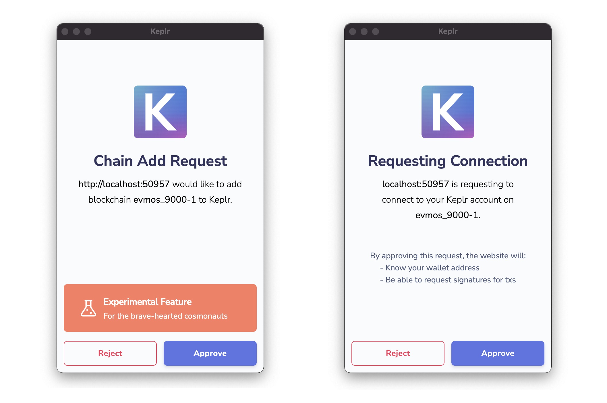
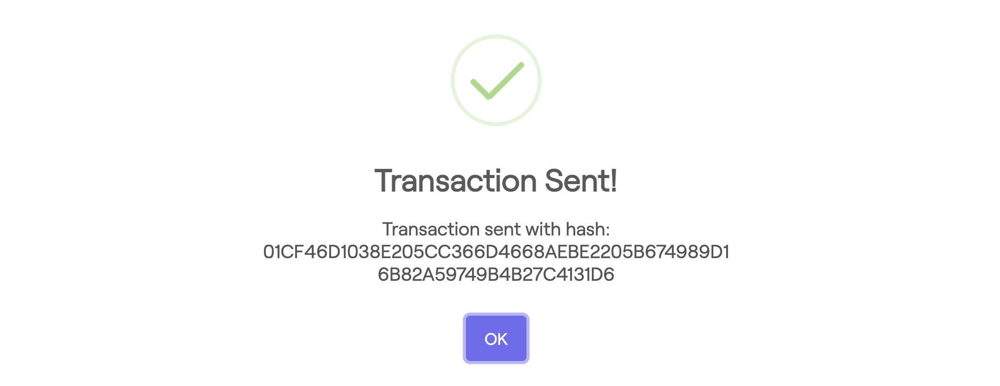
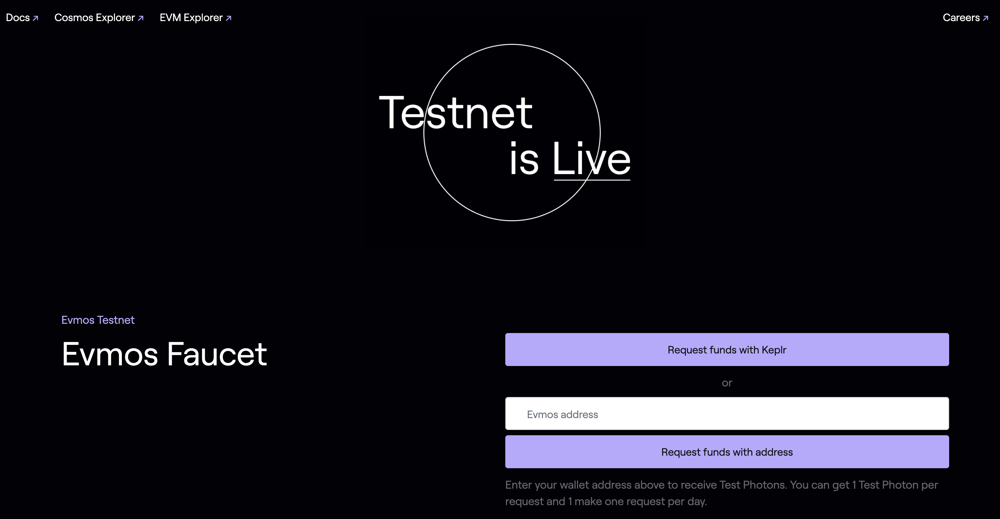

<!--
order: 1
-->

# Faucet

Check how to obtain testnet tokens from the Evmos faucet website {synopsis}

The Evmos Testnet Faucet distributes small amounts of {{ $themeConfig.project.testnet_denom }}
to anyone who can provide a valid testnet address for free.
Request funds from the faucet either by using the [Keplr Wallet](../../users/wallets/keplr.md)
or follow the instructions on this page.

::: tip
Follow the [Metamask](../../users/wallets/metamask.md), [Keplr](../../users/wallets/keplr.md)
or [Keyring](../../users/keys/keyring.md) guides for more info on how to setup your wallet account.
:::

## Request Testnet tokens

<!-- markdown-link-check-disable-next-line -->
Once you are signed in to the Keplr extension,
visit the [Faucet](https://faucet.evmos.dev/) to request tokens for the testnet.
Click the `Request Funds with Keplr` button.
Then approve the both following pop ups `Chain Add Request` and `Request Connection`
to add the {{ $themeConfig.project.name }} testnet chain
(`evmos_{{ $themeConfig.project.testnet_chain_id }}-{{ $themeConfig.project.testnet_version_number }}`)
to Keplr and approve the connection.

After approval, you can see a transaction confirmation informing you
that {{ $themeConfig.project.testnet_denom }} have been successfully transferred
to your [evmos address](../../users/technical_concepts/accounts.md#address-formats-for-clients) on the testnet.

::: warning
**Note**: only Ethereum compatible addresses (i.e `eth_secp256k1` keys) are supported on Evmos.
:::

Alternatively you can also fill in your address on the input field in Bech32 (`evmos1...`) or Hex (`0x...`) format.

::: warning
If you use your Bech32 address, make sure you input the [account address](../../users/technical_concepts/accounts.md#addresses-and-public-keys)
(`evmos1...`) and **NOT** the validator operator address (`evmosvaloper1...`)
:::

View your account balance either by clicking on the Keplr extension or by using the [Testnet Explorer](https://testnet.mintscan.io/evmos-testnet).

::: tip
**Note**: Keplr might not display the amount of {{ $themeConfig.project.testnet_denom }} transferred by the faucet,
as it might be smaller than the number of decimals displayed in the Keplr extension.
:::

## Rate limits

::: tip
All addresses **MUST** be authenticated using ReCAPTCHA before requesting tokens.
:::

To prevent the faucet account from draining the available funds,
the Evmos testnet faucet imposes a maximum number of requests for a period of time.
By default, the faucet service accepts 1 request per day per address.
You can request {{ $themeConfig.project.testnet_denom }} from the faucet for each address only once every 24h.
If you try to request multiple times within the 24h cooldown phase, no transaction will be initiated.
Please try again in 24 hours.

## Amount

For each request, the faucet transfers 1 {{ $themeConfig.project.testnet_denom }} to the given address.

## Faucet Addresses

The public faucet addresses for the testnet are:

- **Bech32**: [`evmos1ht560g3pp729z86s2q6gy5ws6ugnut8r4uhyth`](https://testnet.mintscan.io/evmos-testnet/account/evmos1ht560g3pp729z86s2q6gy5ws6ugnut8r4uhyth)
- **Hex**: [`0xBaE9A7A2210F94511F5050348251d0d7113E2cE3`](https://evm.evmos.dev/address/0xBaE9A7A2210F94511F5050348251d0d7113E2cE3/transactions)
