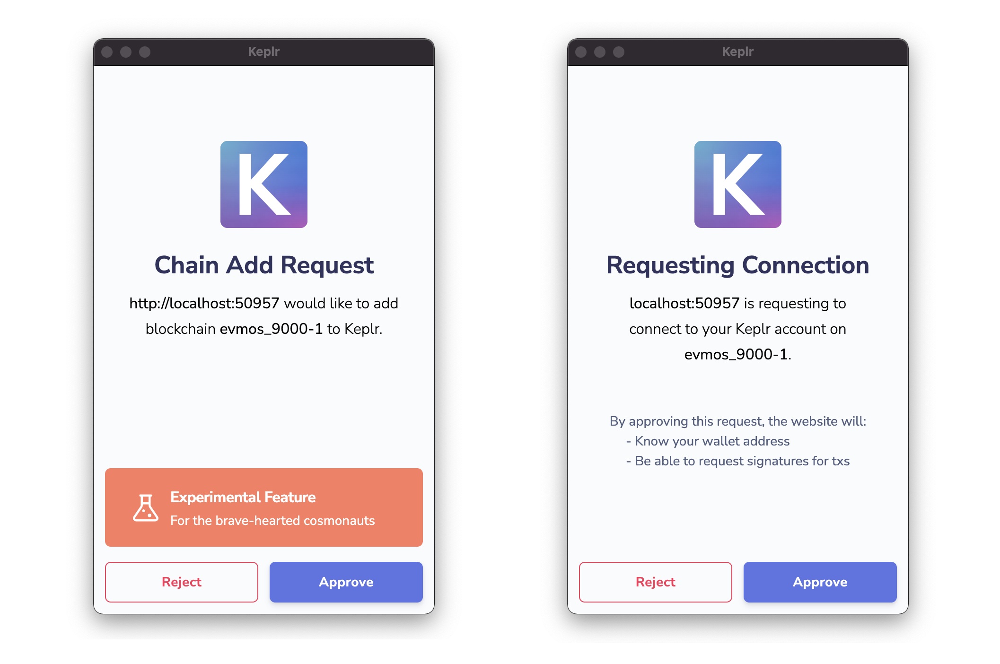
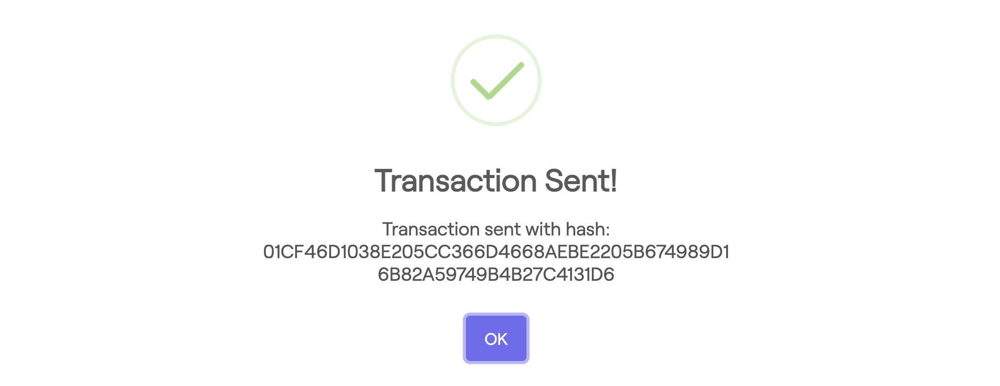

<!--
order: 4
-->

# Keplr

Connect your Keplr wallet with Evmos {synopsis}

## Pre-requisite Readings

- [Install Keplr](https://www.keplr.app/) {prereq}

The Keplr browser extension is a wallet for accessing applications in the Cosmos ecosystem and managing user identities. It can be used to connect to {{ $themeConfig.project.name }} through the official testnet and request Funds from the Faucet.

## Install Keplr

Add the Keplr browser extension following the instructions on the [Keplr website](https://www.keplr.app/). The Keplr extension is officially supported only on Chromium-based explorers.

## Create/Import Account

Open the Keplr extension on your browser. If you are setting up Keplr for the first time, you can either create a new account or import an existing account. Refer to the [Keplr documentation](https://keplr.crunch.help/getting-started) for further information.

## Connect to Evmos Testnet and Request Funds from the Faucet

Once you are signed in to the Keplr extension, visit the [Faucet](https://faucet.evmos.org/) and click the `Request Funds with Keplr` button. Then approve the both following pop ups `Chain Add Request` and `Request Connection` to add the {{ $themeConfig.project.name }} testnet chain (evmos_9000-1) to Keplr and approve the connection.

After approval, you can see a transaction confirmation informing you that {{ $themeConfig.project.testnet_denom }} have been successfully transferred to your [evmos address](../../basics/accounts.md#address-formats-for-clients) on the testnet.

::: tip
You can request {{ $themeConfig.project.testnet_denom }} from the [Faucet](../../testnet/faucet.md) for each address only once every 24h. If you try to request multiple times within the 24h cooldown phase, no transaction will be initiated. Please try again in 24 hours.
:::

View your account balance either by clicking on the Keplr extension or by [interacting with the node](../../quickstart/interact_node.md). Note that Faucet might not display the amount of {{ $themeConfig.project.testnet_denom }} transferred by the Faucet, as it might be smaller than the number of decimals displayed in the Keplr extension.