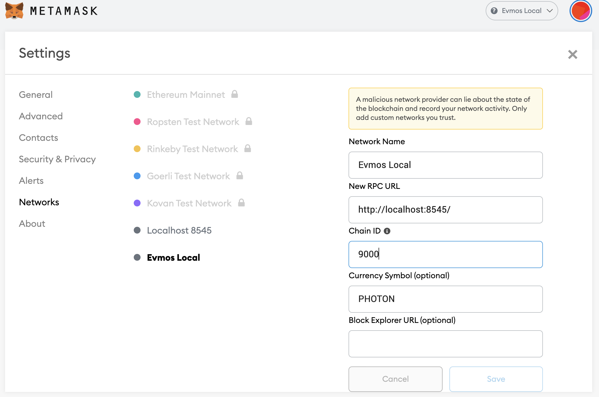

<!--
order: 2
-->

# MetaMask

Connect your MetaMask wallet with Evmos {synopsis}

The MetaMask browser extension is a wallet for accessing Ethereum-enabled applications and managing user identities. It can be used to connect to {{ $themeConfig.project.name }} through the official testnet or via a locally-running {{ $themeConfig.project.name }} node.

::: tip
If you are planning on developing on Evmos locally and you haven’t already set up your own local node, refer to [the quickstart tutorial](../../quickstart/run_node/), or follow the instructions in the [GitHub repository](https://github.com/tharsis/evmos/).
:::

## Adding a New Network

Open the MetaMask extension on your browser, you may have to log in to your MetaMask account if you are not already. Then click the top right circle and go to `Settings` > `Networks` > `Add Network` and fill the form as shown below.

::: tip
You can also find the full `ChainID` form the `genesis.json` file. To get the [EIP155](https://github.com/ethereum/EIPs/blob/master/EIPS/eip-155.md) chain ID from the Cosmos chain ID, check the [Chain ID](./../../basics/chain_id) documentation page.
:::



Here is the list of fields that you can use to paste on Metamask:

:::: tabs
::: tab Local Node

- **Network Name:** `{{ $themeConfig.project.name }} Local`
- **New RPC URL:** `{{ $themeConfig.project.rpc_url_local }}`
- **Chain ID:** `{{ $themeConfig.project.testnet_chain_id }}`
- **Currency Symbol (optional):** `{{ $themeConfig.project.testnet_ticker }}`
- **Block Explorer URL (optional):** `n/a`
:::
::: tab Testnet
- **Network Name:** `{{ $themeConfig.project.name }} Testnet`
- **New RPC URL:** `{{ $themeConfig.project.rpc_url_testnet }}`
- **Chain ID:** `{{ $themeConfig.project.testnet_chain_id }}`
- **Currency Symbol (optional):** `{{ $themeConfig.project.testnet_ticker }}`
- **Block Explorer URL (optional):** `{{ $themeConfig.project.block_explorer_url }}`
:::
::::

## Import Account to Metamask

Then close the settings, and go to `My Accounts` (top right circle) and select `Import Account`. You should see an image like the following one:


Now you can export your private key from the terminal using the following command. Again, make sure to replace `mykey` with the name of the key that you want to export and use the correct `keyring-backend`:

```bash
evmosd keys unsafe-export-eth-key mykey --keyring-backend test
```

Go back to the browser and select the `Private Key` option. Then paste the private key exported from the `unsafe-export-eth-key` command.

Your account balance should show up as `1 {{ $themeConfig.project.testnet_ticker }}` and do transfers as usual.

::: tip
If it takes some time to load the balance of the account, change the network to `Main Ethereum
Network` (or any other than `Localhost 8545` or `{{ $themeConfig.project.name }}`) and then switch back to `{{ $themeConfig.project.name }}`.
:::

## Downloading State

To see your Metamask logs, click the top right circle and go to `Settings` > `Advanced` > `Download State Logs`. If you search through the JSON file for the account address you'll find the transaction history.
