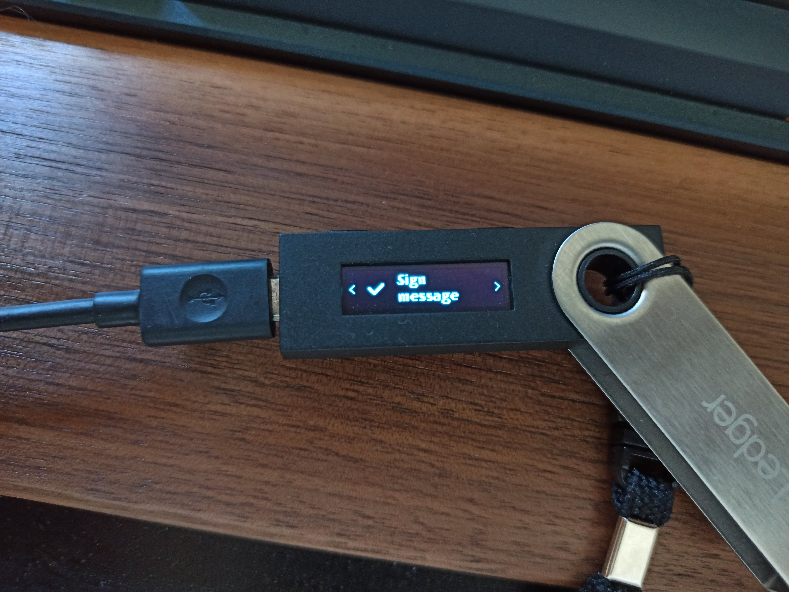

# Ledger Guide

- Prerequisites
    - Ledger [Nano X](https://shop.ledger.com/pages/ledger-nano-x) or [Nano S](https://shop.ledger.com/products/ledger-nano-s) device (compare [here](https://shop.ledger.com/pages/hardware-wallets-comparison))
    - [Ledger Live](https://www.ledger.com/ledger-live) installed
    - Metamask installed
    - Ethereum Ledger app installed
    - Versions (Firmware and Ethereum app)

Get started with your Ledger hardware wallet on Evmos. {synopsis}

## Introduction

[Ledger](https://www.ledger.com/)'s hardware wallets are cryptocurrency wallets that are used to store private keys offline.

“Hardware wallets are a form of offline storage. A hardware wallet is a cryptocurrency wallet that stores the user's private keys (a critical piece of information used to authorize outgoing transactions on the blockchain network) in a secure hardware device.”
[Investopedia](https://www.investopedia.com/terms/l/ledger-wallet.asp)

## Installation

## Ethereum Ledger App

If you want to connect to Evmos mainnet and Evmos testnet, you can use the Ethereum Ledger app on Ledger Live by setting the chain ID.

First, you will need to install the Ethereum Ledger app by following the instructions below:

1. Open up Ledger Live app on your Desktop
2. Select **Manager** from the menu
3. Connect and unlock your device (this must be done before installation)
4. In the **App catalog** search for `Ethereum (ETH)` and click **Install**. Your Ledger device will show **Processing** and once the installation is complete, the app will appear on your Ledger device

In the Ledger Live app, you should see the Ethereum app listed under the **Apps installed** tab on the **Manager** page. After the app has been successfully installed, you can close out of Ledger Live.

### List of Chain IDs for Ethereum app

|  | EIP155 chain ID |
| --- | --- |
| Evmos mainnet | 9001 |
| Evmos testnet | 9000 |

## Import your Ledger Account

### Metamask

Now that you've installed the app on Ledger Live, you can connect your Ledger to your computer and unlock it with your PIN-code and open the Ethereum app.

Now you can import your Ledger account to MetaMask by using the following steps:

1. Click on connect hardware wallet

- Select Ledger hardware wallet:

- Select your connected Ledger Device

- Import the addresses that you want to use

## EIP712 signing

In order to sign Cosmos transactions (staking, voting on proposals, IBC transfers), with Ledger hardware wallets, we implemented EIP712.

EIP712 means that the signer will generate a signature for something like a JSON representation of the Cosmos transaction and that signature will be included in the Cosmos transaction itself.

### Example - Cosmos transaction using Evmos.me

**Get your address in both encodings**

After connecting the Ledger wallet to Metamask and connecting to the [https://evmos.me](https://evmos.me) webpage, it will display our wallet formatted on `bech32` and `hex` representation, we need these values to make sure that the message that we are going to sign is the correct one.

**Create a Cosmos transaction**

In this example, we are going to create a simple message to send tokens to a recipient*.*

After clicking `Send Coins`, Metamask will ask us to sign the typed message

**Sign with Metamask and Ledger**

You can see the complete message to be signed

**Validate the data before signing!**

- `feePayer`: represents the wallet that is signing the message. So it MUST match yours, if it’s different your transaction will be invalid.
- `fee`: amount to be paid to send the transaction.
- `gas`: max gas that can be spent by this transaction (aka gas limit).
- `memo`: transaction note or comment.
- `msgs`: This is the content of the cosmos transaction, in this example, we need to make sure that we are using a MsgSend, and that the *to_address* is the one that we want to send the founds. Also, we can verify that we are actually sending *10000aevmos* to that wallet.

### **Ledger signing**

If you have a Ledger connected to Metamask, you need to use it to sign the message.

The Ledger device will display the domain hash and message hash before asking you to sign the transaction.

**Broadcast the transaction**

After signing the message, that signature needs to be added to the cosmos transaction and broadcasted to the network.

This step should be done automatically by the same service that generated the message, in this case, **[evmos.me](http://evmos.me)** will broadcast the transaction for you.

### Common errors

- Make sure that the Ethereum Ledger app is installed. The Cosmos Ledger app is not supported on the Evmos chain at the moment.
- Make sure you have created at least one Ethereum address on the Ledger Ethereum app.
- Make sure the Ledger device is unlocked and with the Ledger Ethereum app opened before starting the importing process.

### Known issues

- The denomination displayed as `ETH` when importing the wallet because we are using the Ethereum app.
- If you have Metamask correctly configured, the balance on the extension will be displayed as `EVMOS`, but on the Ledger device it will be displayed as `ETH`. Make sure you are on the correct network before signing any transaction!

## FAQ

1. I can’t generate keys using the CLI with `evmosd` with the `--ledger` flag

CLI bindings with `evmosd` binary are not currently supported. In the meantime, you can use EIP712. See the [sign cosmos txs](#cosmos-transactions) section for reference.

1. I can’t generate a native multisig using the `evmosd` CLI and and Ledger

See 1.

1. I can’t use Ledger for my validator

See 1.

1. I can’t use Metamask with the Cosmos Ledger app

Since Evmos only support Ethereum keys and uses the same HD path as Ethereum, the Cosmos Ledger app doesn’t work to sign cosmos transactions.

1. How can I generate Cosmos `sep256k1` keys?

Cosmos `sep256k1` keys are not supported on Evmos. Only Ethereum keys (`eth_secp256k1`)  can be generated.
