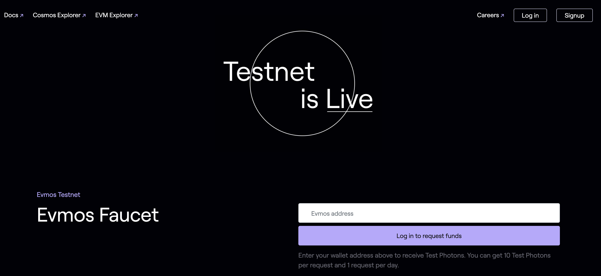

<!--
order: 2
-->

# Faucet

Check how to obtain testnet tokens from the Evmos faucet website {synopsis}

## Requesting tokens

You can request tokens for the testnet by using the Evmos [faucet](https://faucet.evmos.org).
Simply fill in your address on the input field in bech32 (`evmos1...`) or hex (`0x...`) format.

::: warning
If you use your bech32 address, make sure you input the [account address](./../basics/accounts#addresses-and-public-keys) (`evmos1...`) and **NOT** the validator operator address (`evmosvaloper1...`)
:::

## Rate limits

To prevent the faucet account from draining the available funds, the Evmos testnet faucet
imposes a maximum number of request for a period of time. By default the faucet service accepts 1
request per day per address. All addresses **must** be authenticated using
[Auth0](https://auth0.com/) before requesting tokens.

<!-- TODO: add screenshots of authentication window -->

## Amount

For each request, the faucet transfers 1 {{ $themeConfig.project.testnet_denom }} to the given address.
