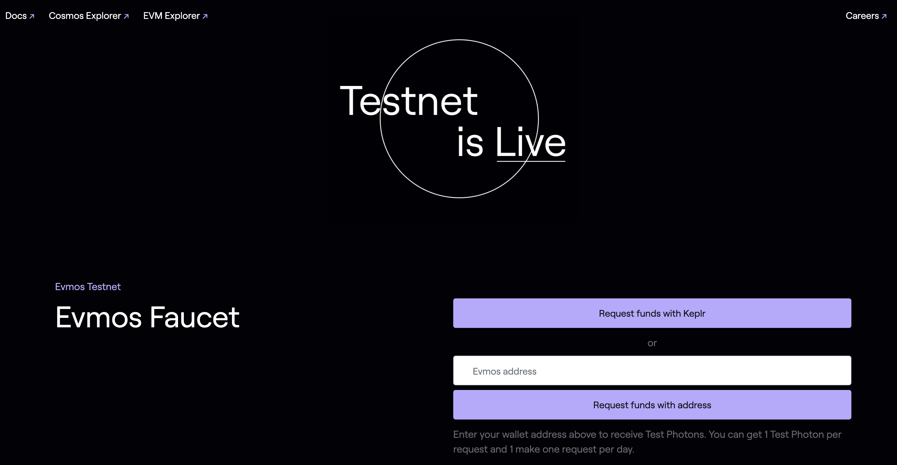

<!--
order: 2
-->

# Faucet

Check how to obtain testnet tokens from the Evmos faucet website {synopsis}

The Evmos Testnet Faucet distributes small amounts of {{ $themeConfig.project.testnet_denom }} to anyone who can provide a valid testnet address for free. Request funds from the Faucet either by using the [Keplr Wallet](../guides/keys-wallets/keplr.md) or follow the instructions on this page.

## Obtain address

### Keyring

1. You can generate an Evmos key by using the [Keyring](./../guides/keys-wallets/keyring.md):

```bash
evmosd keys add testnet-key
```

You can obtain your key [Bech32](./../basics/accounts.md#addresses-and-public-keys) address by typing:

```bash
evmosd keys show testnet-key
```

### Metamask

1. Add the Testnet to the [Metamask](./../guides/keys-wallets/metamask.md) Networks settings.
2. Copy your Hex address and use the [`debug`](./../basics/accounts.md#addresses-conversion) command to obtain the Bech32 address

  ```bash
  evmosd debug addr 0x...
  ```

::: tip
Follow the [Metamask guide](./../guides/keys-wallets/metamask.md) for more info on how to setup your wallet accounts.
:::

## Request tokens

<!-- TODO: update to support Hex format -->
You can request tokens for the testnet by using the Evmos [faucet](https://faucet.evmos.org).
Simply fill in your address on the input field in Bech32 (`evmos1...`) format.

::: warning
If you use your Bech32 address, make sure you input the [account address](./../basics/accounts.md#addresses-and-public-keys) (`evmos1...`) and **NOT** the validator operator address (`evmosvaloper1...`)
:::



## Rate limits

To prevent the faucet account from draining the available funds, the Evmos testnet faucet
imposes a maximum number of request for a period of time. By default the faucet service accepts 1
request per day per address. All addresses **must** be authenticated using
[Auth0](https://auth0.com/) before requesting tokens.

<!-- TODO: add screenshots of authentication window -->

## Amount

For each request, the faucet transfers 1 {{ $themeConfig.project.testnet_denom }} to the given address.

## Faucet Addresses

The public faucet addresses for the testnet are:

- **Hex**: [`0x1549d29D1d51A694Cd5bbC89bF2c5F86ea5cE151`](https://evm.evmos.org/address/0x1549d29D1d51A694Cd5bbC89bF2c5F86ea5cE151/transactions)
- **Bech32**: [`evmos1z4ya98ga2xnffn2mhjym7tzlsm49ec23890sze`](https://explorer.evmos.org/accounts/evmos1z4ya98ga2xnffn2mhjym7tzlsm49ec23890sze)
