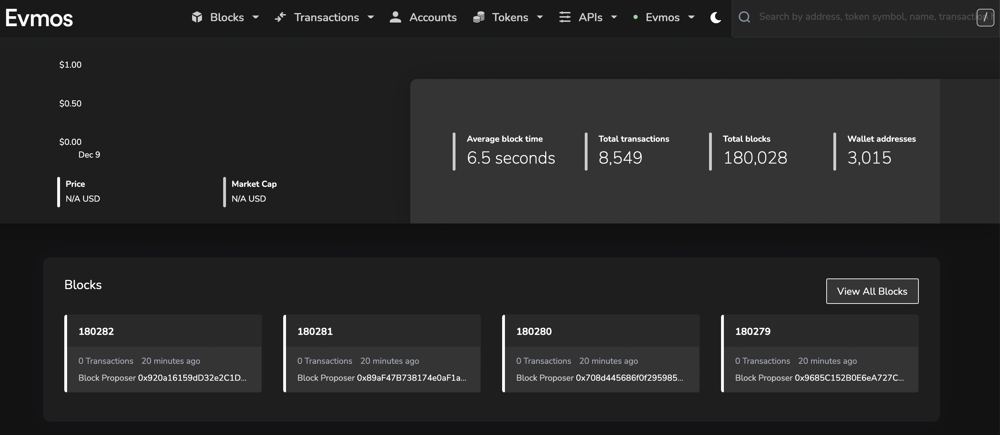

<!--
order: 1
-->

# Block Explorers

Read about the different types of block explorers on Evmos. {synopsis}

## Introduction

Blockchain explorers allow users to query the blockchain for data. Explorers are often compared to search engines for the blockchain. By using an explorer, users can search and track balances, transactions, contracts, and other broadcasted data to the blockchain.

Evmos offers two types block explorers: an EVM explorer and a Cosmos explorer. Each explorer queries data respective to their environment with the EVM explorers querying Ethereum-formatted data (blocks, transactions, accounts, smart contracts etc) and the Cosmos explorers querying Cosmos-formatted data (Cosmos and IBC transactions, blocks, accounts, module data, etc).

### List of Block Explorers

Below is a list of public block explorers that support Evmos Mainnet and Testnet:

:::: tabs
::: tab Mainnet

|                      | Category | URL                    |
| -------------------- | -------- | ---------------------- |
| Mintscan   | `cosmos` | TDB |
| Blockscout  | `evm`    | TBD                       |
:::
::: tab Testnet

|                      | Category | URL                    |
| -------------------- | -------- | ---------------------- |
| Mintscan   | `cosmos` | [explorer.evmos.dev](https://explorer.evmos.dev/) |
| Blockscout  | `evm`    | [evm.evmos.dev](https://evm.evmos.dev/)                       |
:::
::::

## EVM-based

### Blockscout

The [Evmos EVM explorer](https://evm.evmos.org/) is the EVM explorer for Evmos. The EVM explorer allows users to view Evmos EVM activity such as smart contract creations, interactions, token transfers, and other types of transactions. Users can also view Evmos and ERC-20 token balances through the Evmos EVM Explorer

## Cosmos-based

### Mintscan

The [Mintscan explorer](https://explorer.evmos.org/) is the Cosmos explorer for Evmos. The Mintscan Cosmos-based explorer allows users to view Evmos activity within the Cosmos ecosystem. This explorer allows users to query transactions, delegations, IBC token transfers, and other Cosmos-related Evmos activity. Users can also view tokenomics and governance data using the Evmos Cosmos-based explorer.
